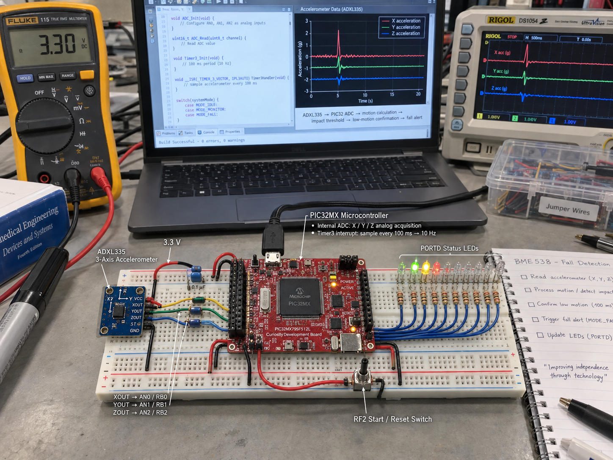
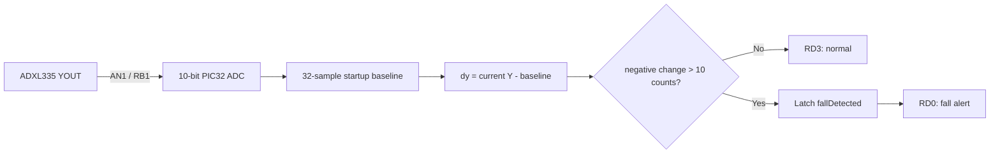
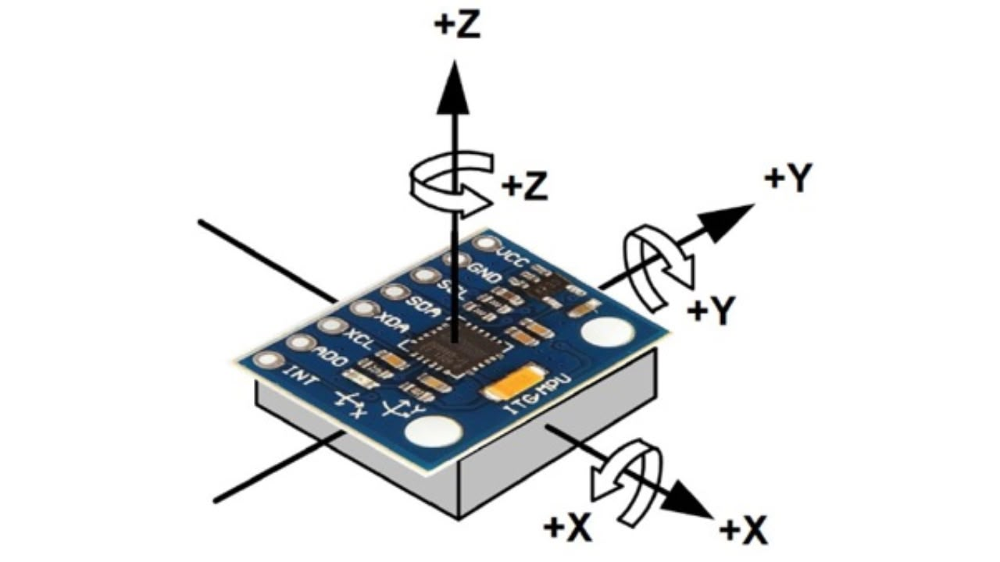
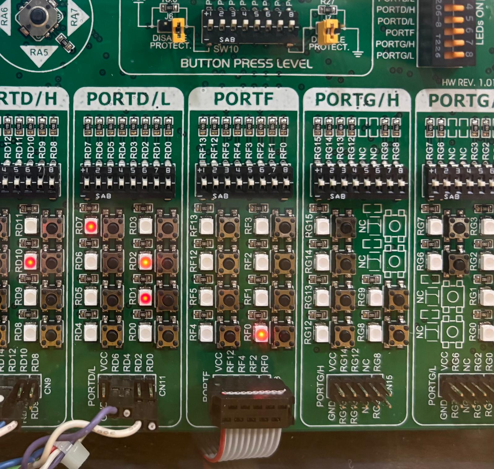

# Elderly Fall-Detection System

A real-time embedded fall-detection prototype built with a PIC32MX microcontroller and an ADXL335 three-axis analog accelerometer. The checked-in firmware is a focused negative-Y proof of concept: it calibrates a resting Y-axis baseline, detects a sufficiently large downward deviation, latches the alert, and communicates system state through two PORTD LEDs.



## What the firmware actually implements



At startup, the device assumes the sensor is stationary and averages 32 readings from AN1. The main loop then compares each new Y-axis sample with that baseline. A negative deviation larger than `FALL_Y_DELTA` latches the fall state until the microcontroller is reset.

```c
if ((baseY - currentY) > FALL_Y_DELTA) {
    fallDetected = 1;
}
```

## Verified implementation details

| Item | Checked-in firmware |
| --- | --- |
| Microcontroller | PIC32MX460F512L |
| Sensor | ADXL335 analog accelerometer |
| ADC | PIC32MX internal **10-bit** ADC |
| ADC range | 0–1023 counts |
| Active sensor channel | Y axis on AN1 / RB1 |
| Also configured as analog | AN0 / RB0 and AN2 / RB2 |
| Startup calibration | 32 Y-axis samples |
| Fall threshold | 10 ADC counts below the baseline |
| Normal indicator | RD3 on |
| Fall indicator | RD0 on |
| Alert behavior | Latched until reset |
| System clock | 32 MHz |
| Peripheral-bus clock | 16 MHz |
| Sampling method | Polling with software delays |

The `uint16_t` return type in `ADC_Read()` is only the C storage type. It does not make the conversion 12-bit. The selected PIC32MX device provides a 10-bit ADC, as documented in the [PIC32MX3xx/4xx family data sheet](https://ww1.microchip.com/downloads/en/DeviceDoc/PIC32MX_Datasheet_v3_61143C.pdf).

## Hardware connections

| ADXL335 signal | PIC32 connection | Firmware use |
| --- | --- | --- |
| `XOUT` | RB0 / AN0 | Configured as analog; not sampled by this demo |
| `YOUT` | RB1 / AN1 | Sampled for fall detection |
| `ZOUT` | RB2 / AN2 | Configured as analog; not sampled by this demo |
| `VCC` | 3.3 V | Sensor supply |
| `GND` | GND | Common ground |
| `ST` | Unconnected | Self-test unused |

The ADXL335 is a ±3 g analog-output accelerometer. Its output is ratiometric: the nominal zero-g level is approximately half the supply voltage, and typical sensitivity at 3.3 V is approximately 330 mV/g. See the [ADXL335 data sheet](https://www.analog.com/media/en/technical-documentation/data-sheets/adxl335.pdf) for electrical limits and bandwidth selection.



## LED behavior

The current firmware always drives exactly one status LED:

- **Normal:** `LATD = 0x0008`, so RD3 is on.
- **Fall detected:** `LATD = 0x0001`, so RD0 is on.



The supplied hardware references also include an [EasyPIC PRO v7 board image](docs/images/easypic-pro-v7.jpeg). Board revisions route peripherals differently, so use the MPLAB target configuration and the schematic for the exact board in front of you rather than assuming every pictured connector is pin-compatible.

## Build and program

### Requirements

- MPLAB X IDE
- MPLAB XC32 compiler 4.60 or a compatible release
- PIC32MX device family pack 1.5.259 or a compatible release
- PIC32MX460F512L target board
- ICD 3 or another supported PIC programmer/debugger

### Steps

1. Open MPLAB X IDE.
2. Choose **File → Open Project**.
3. Select `firmware/termproject1.X`.
4. Confirm that the active target device is `PIC32MX460F512L`.
5. Build the project with **Run → Build Project**.
6. Connect the programmer and target hardware.
7. Program the device, keeping the accelerometer stationary during the initial 32-sample calibration.
8. Move the sensor in the negative-Y direction to tune and verify `FALL_Y_DELTA` for the final mounting orientation.

The source archive contained XC32 4.60 production build artifacts, including a linked HEX/ELF. Generated binaries and machine-specific build folders are excluded from this repository because MPLAB can recreate them from the source project.

## Report architecture versus repository firmware

The broader BME538 report describes a more complete three-axis design with Timer3 sampling, a three-state finite-state machine, a 400-count impact threshold, a 100-count low-motion threshold, ten confirmation samples, an RF2 start/reset switch, and a ten-LED activity display. Those elements are **not present in the checked-in `Main.c`**.

| Feature | Broader report design | Checked-in firmware |
| --- | --- | --- |
| Accelerometer processing | X, Y, and Z | Y only |
| Timing | Timer3 at 100 ms / 10 Hz | Software-delay polling; rate is not calibrated |
| Decision logic | Impact followed by one second of low motion | Single negative-Y threshold |
| Thresholds | Impact 400; motionless 100 | Negative-Y delta 10 |
| Control | IDLE / MONITOR / FALL FSM | Boolean latched alert |
| User input | RF2 arm/reset switch | Not configured |
| Output | Ten-LED status/activity bar | RD3 normal or RD0 fall |

This distinction is intentional in the documentation: it makes the repository reproducible and prevents the report's proposed behavior from being mistaken for behavior implemented by this particular source snapshot.

## Limitations and next steps

- A direction-specific threshold can miss falls in other orientations and may trigger during ordinary rapid motion.
- The polling interval depends on compiler output and clock timing; it is not a guaranteed 10 Hz sample rate.
- The baseline is captured only at startup and does not adapt to long-term drift or repositioning.
- Once triggered, the alert requires a device reset because no software reset input is implemented.
- The algorithm does not confirm post-impact immobility or estimate body orientation.

A logical next version would add Timer3-based fixed-rate sampling, all three axes, acceleration-magnitude processing, impact-plus-inactivity confirmation, an explicit IDLE/MONITOR/FALL state machine, and a user-controlled reset input. A gyroscope or digital IMU could further improve posture estimation and reduce false positives.

## Safety and intended use

This is an educational engineering prototype, **not a certified medical device**. It must not be relied upon for emergency response, diagnosis, or unsupervised patient monitoring. Any real assistive product would require validated sensing, fault handling, communications, battery monitoring, human-factors testing, and appropriate medical-device risk management.

## Project structure

```text
firmware/termproject1.X/
├── Main.c                 Baseline calibration, detection, and LED logic
├── ADC.c                  PIC32 ADC initialization and channel reads
├── ADC.h                  ADC interface
├── Makefile               MPLAB X project entry point
└── nbproject/             Portable MPLAB X project configuration

docs/images/               Hardware and sensor reference images
```

Authors: Ahmad Awad and Rayan Qouta.
